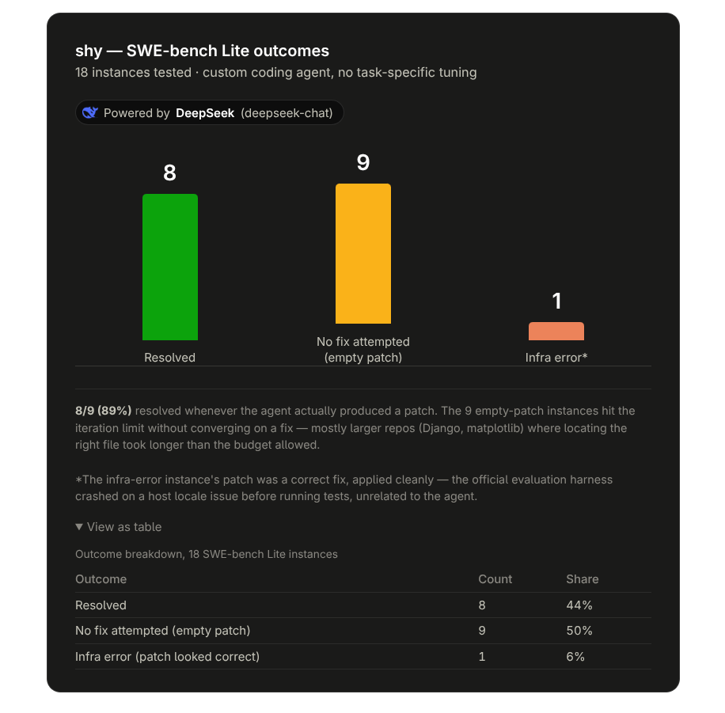

# shy

A coding agent harness built from scratch in TypeScript — the same shape as tools
like Claude Code or Devin: a loop that gives an LLM a set of tools (bash, read,
write, edit, grep), lets it work autonomously toward a task, and traces every
step. Built to actually understand how these systems work, not just use one.

Runs on [Bun](https://bun.com), talks to any OpenAI-compatible chat completions
API (currently wired to DeepSeek).

## Results

**Private eval suite:** 11/11 tasks passing (file creation, editing, bash,
multi-file grep/reasoning, bug-fixing, ambiguous/misleading instructions,
multi-file rename, verify-before-done).

**SWE-bench Lite** (same 18 real GitHub issues, official Docker-based evaluation,
re-run after each round of harness changes — no task-specific tuning):

| Iteration | Resolved | Wrong fix | Gave up (empty patch) |
|---|---|---|---|
| Baseline | 8/18 · 44% | 0 | 9 |
| + context compaction, parallel tool calls, retry/backoff | 10/18 · 56% | 2 | 6 |
| + `glob`, `web_fetch` tools | 12/18 · 67% | 4 | 2 |
| + "verify before done" rule | **12/18 · 67%** | **2** | 4 |

Two different improvements, two different effects: `glob` mostly fixed
*give-ups* — the agent could finally find the right file in large repos
(Django, matplotlib) instead of guessing paths, so it attempted far more
fixes (16/18 vs 12/18 before). That also meant more *wrong* fixes (4).
Adding an explicit "run the test and read the output before declaring done"
rule to the system prompt cut those wrong fixes back to 2 — same resolved
count, but the agent is now less likely to confidently ship something broken,
even though that shows up as a couple more give-ups instead of bad attempts.



Full reports: `swebench/shy-deepseek.shy-verify-rerun.json` (current),
`swebench/shy-deepseek.shy-glob-rerun.json`, `shy-deepseek.shy-rerun-18.json`,
earlier baseline in `swebench/shy-deepseek.shy-bigrun-15.json` +
`shy-deepseek.shy-smoke-test-v2.json`.

## Architecture

```
task ──> system prompt + tools ──> LLM call ──> tool calls?
                 ▲                                  │
                 │                                  ▼
          push results back                   run tools (parallel)
                 ▲                                  │
                 └──────────────────────────────────┘
                     repeat until stop / max iterations
```

- **`src/core/loop.ts`** — the agent loop. Calls the model, executes any tool
  calls it asks for (in parallel via `Promise.all`), feeds results back, repeats.
- **`src/core/llm.ts`** — the only network-touching module. Wraps the OpenAI SDK
  against DeepSeek's compatible endpoint, with retry + exponential backoff on
  transient errors (429 / 5xx / connection timeouts).
- **`src/core/context.ts`** — context compaction. When the running conversation
  crosses a token threshold, older messages get summarized into one message by
  an extra LLM call, keeping the last few turns intact — otherwise a long task
  would eventually blow past the model's context window.
- **`src/tools/`** — `bash`, `read`, `write`, `edit`, `grep`, `glob`, `web_fetch`.
  Each is a plain `{ name, description, parameters, execute }` object; the loop
  doesn't know or care what a tool does internally. Built on Node's
  `child_process`/`fs` (not Bun-only APIs) so the same harness runs unmodified
  under the Bun CLI and inside Next.js API routes. `bash` blocks destructive
  command patterns before running them; `web_fetch` refuses local/internal
  addresses (SSRF guardrail) and its results are flagged to the model as
  untrusted content in the system prompt.
- **`src/tools/spawn_subagent.ts`** — delegates an independent sub-task to a
  fresh agent with its own clean context and system prompt, returning only a
  short summary to the parent (not the sub-agent's full conversation). Built
  as a factory (`createSpawnSubagentTool(config)`) rather than a static tool
  object, since it needs to build a config for the sub-agent to run inside;
  one level of nesting only — a sub-agent can't spawn one of its own.
- **`src/trace/logger.ts`** — every model call, tool call, and compaction event
  is appended as JSONL to `logs/`, and also broadcast live over an in-process
  event emitter (used by the demo UI).
- **`src/prompts/system.ts`** — the system prompt: tool-selection rules and
  working-style rules, tuned against the eval suite (see below).

## Running it

```bash
bun install
echo "DEEPSEEK_API_KEY=..." > .env

bun run start "find all TODOs in src and count them"
```

### Live demo UI

```bash
ln -sf ../.env web/.env   # first time only, so Next.js can see DEEPSEEK_API_KEY
bun run demo
# open http://localhost:3000
```

A Next.js app (`web/`) whose API routes (`web/app/api/run`, `web/app/api/meta`)
import the harness directly and stream every trace event over SSE to the
browser — watch the loop reason, call tools, and answer in real time, with
per-run token/iteration stats.

### Eval suite

```bash
bun run evals/runner.ts
```

Runs every task in `evals/tasks/`, each in an isolated, cleaned directory, with
an objective pass/fail via a shell exit code (`check.sh`). Results are written
to `evals/results/`. This suite is what caught every real bug in this project —
see "What building this actually taught me" below.

### SWE-bench

```bash
python3 -m venv .swebench-venv && source .swebench-venv/bin/activate
pip install datasets swebench

python3 swebench/select_instances.py 15      # pick N instances from the dataset
deactivate
bun run swebench/run.ts                      # clone repo, run the agent, capture the diff

source .swebench-venv/bin/activate
IDS=$(python3 -c "import json; print(' '.join(x['instance_id'] for x in json.load(open('swebench/data/instances.json'))))")
python3 -m swebench.harness.run_evaluation \
  -d SWE-bench/SWE-bench_Lite -p swebench/predictions.jsonl \
  -id my-run -i $IDS --max_workers 4 --report_dir swebench
```

`swebench/run.ts` is the adapter: clone the repo at the issue's base commit,
run `runLoop()` with the issue text as the task, capture `git diff` as the
patch. Evaluation (does the patch actually make the right tests pass) runs
through the official SWE-bench Docker harness, not anything custom.

## What building this actually taught me

The eval suite found real bugs, not synthetic ones:

- **Trace logs polluting eval directories** — the logger used a relative path,
  so once the eval runner `chdir`'d into a task folder, logs got written inside
  it and a `grep`-based check started counting the log file's own output. Fixed
  by capturing the project root before any `chdir`.
- **A timeout that didn't time out** — `proc.kill()` on a `sh -c` wrapper only
  signals `sh`, not the command it spawned; `sh` defers SIGTERM while blocked on
  its child. A `sleep 10` ran the full 10s under a 3s timeout. Fixed by shelling
  out through the `timeout` utility instead, which manages the whole process
  group correctly.
- **The agent doing full filesystem searches** for files already in its working
  directory — added an explicit rule to the system prompt, which dropped one
  eval task's duration from 36s to 5s.

## Project structure

```
src/
  core/     agent loop, LLM client, config, types, context compaction
  tools/    bash, read, write, edit, grep
  trace/    JSONL logger + live event emitter
  prompts/  system prompt
evals/
  runner.ts    isolated-directory eval harness
  tasks/       8 tasks: file I/O, bash, grep, bug-fixing, ambiguity
swebench/
  run.ts               agent <-> SWE-bench adapter
  select_instances.py  dataset sampling
web/                   Next.js demo UI
  app/api/run/         SSE endpoint — runs the loop, streams trace events
  app/api/meta/        system prompt + tool list
  app/page.tsx          chat/terminal UI
  lib/agent.ts          shared config, imports the harness from ../src
```
